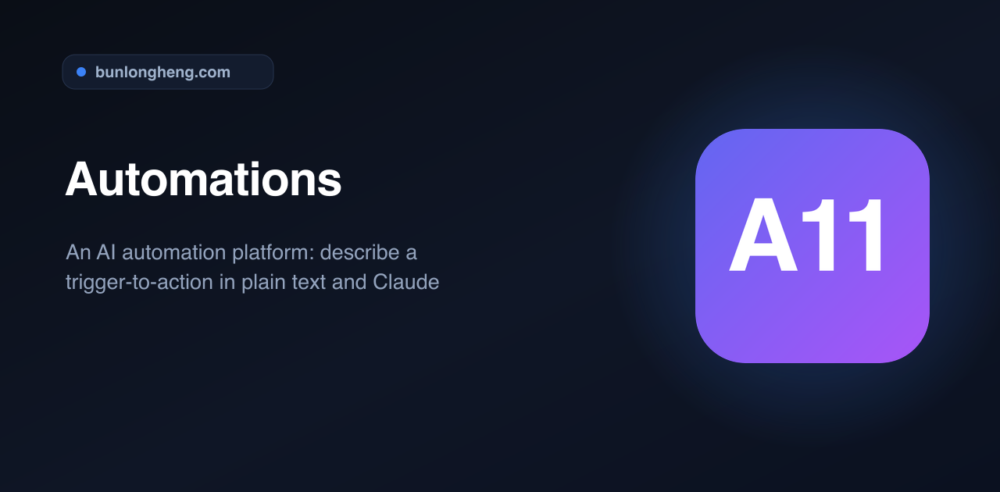
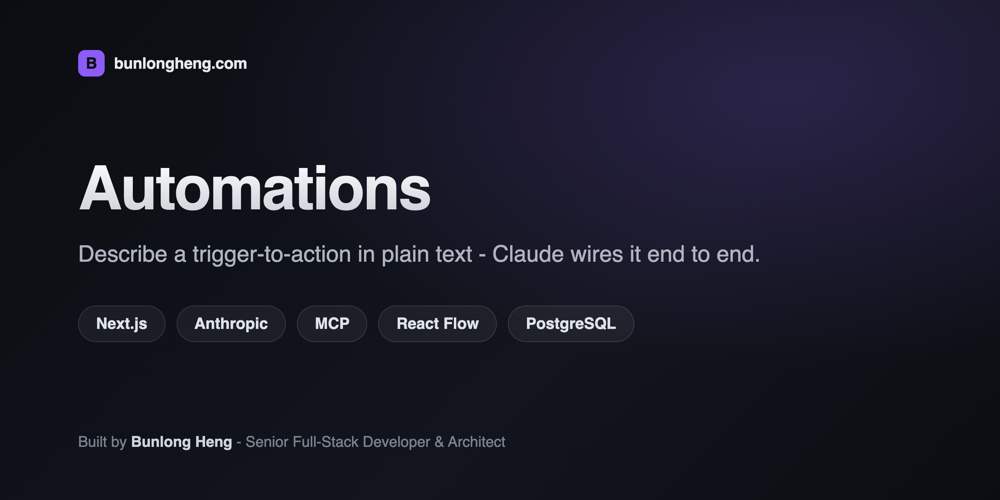
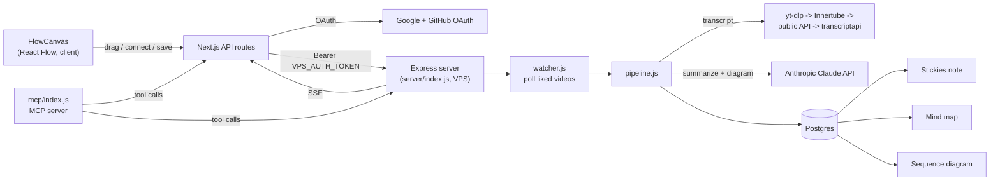

<div align="center">
  
  <h1>Automations</h1>
  <p><em>An AI automation platform: describe a trigger-to-action in plain text and Claude wires it</em></p>
  <p><a href="https://github.com/bunlongheng/automations">Repo</a> &middot; <a href="https://bunlongheng.com/projects?name=automations">Portfolio</a></p>
  
</div>

---

<div align="center">

# Automations

<p align="center"></p>


Visual node-graph automation flow builder - drag trigger and action nodes onto a React Flow canvas, wire them with gradient edges, and a VPS-side pipeline polls, executes, and delivers the output.

[](LICENSE)


</div>

## Contents

- [Features](#features)
- [How it works](#how-it-works)
- [Tech stack](#tech-stack)
- [Getting started](#getting-started)
- [Environment variables](#environment-variables)
- [Project layout](#project-layout)
- [License](#license)

## Features

- **Drag-and-drop canvas** (`components/FlowCanvas.tsx`, `@xyflow/react`) - drag an integration from the sidebar onto the canvas, pick "Add as Trigger" or "Add as Action" in a two-column modal, and the node drops in with an auto-centered layout (triggers left, actions right).
- **12 integrations, 5 categories** (`data/integrations.ts`) - YouTube, Gmail, GitHub, Slack, Calendar, Webhook, Stickies, Diagram, Mind Map, Claude, Philips Hue, and Open Claw, each with its own typed trigger/action list.
- **Gradient bezier edges** (`components/edges/GradientEdge.tsx`) - connections animate and are colored by a gradient between the source and target integration's brand color.
- **Auto-connect + auto-name** - dropping exactly one trigger and one action wires them automatically; the flow name is derived live from the chain (e.g. `YouTube Liked > Diagram`), and `Cmd+S` saves it.
- **Per-node config panel** (`components/panels/NodeConfigPanel.tsx`) - configure trigger conditions and action parameters without leaving the canvas.
- **Code view** (`components/panels/CodePanel.tsx`) - generates a readable DSL rendering of the current graph (`automation { trigger { } | action { } }`, chain-aware, with syntax highlighting) that can be copied with one click.
- **Mobile wizard** (`components/MobileWizard.tsx`) - a step-based, canvas-free builder as the small-screen alternative to drag-and-drop.
- **Connections panel** (`components/ConnectionsPanel.tsx`) - Google (YouTube/Gmail/Calendar) and GitHub OAuth, plus a live "check connections" ping that verifies each integration is actually reachable, not just marked connected in the DB.
- **Run tracking** - the automations list shows `total_runs`, `success_runs`, and `last_run` per flow, and inactive automations render desaturated.
- **Live status via SSE** (`app/api/events/route.ts`) - proxies a Server-Sent Events stream from the VPS pipeline to the browser.
- **YouTube pipeline** (`server/pipeline.js`) - watches liked videos, pulls the transcript through a 4-method fallback chain (yt-dlp with cookies/residential proxy -> multi-client Innertube -> public API -> paid transcriptapi.com), summarizes it with Claude, and delivers the result to Stickies while generating a mind map and a Mermaid sequence diagram from the same summary in parallel.
- **MCP server** (`mcp/index.js`) - exposes `list_automations`, `get_automation`, `toggle_automation`, `delete_automation`, `process_youtube_video`, `unlike_youtube_video`, `list_youtube_likes`, `get_youtube_status`, `check_connections`, `list_connections`, and `connect_integration` as tools so an agent (e.g. Claude Code) can drive automations directly.

## How it works

The app is split across two processes: a Next.js UI/API layer (canvas, OAuth, config) and an always-on Express server on a VPS that owns the poll loop, Postgres writes, and the YouTube pipeline. The Next.js side never talks to Postgres directly - every read/write proxies through the VPS over a bearer token.



## Tech stack

| Layer | Technology |
|-------|-----------|
| Framework | Next.js 16 (App Router) |
| UI | React 19, Tailwind CSS, `motion` |
| Language | TypeScript |
| Graph editor | `@xyflow/react` (React Flow) |
| Auth | Supabase (`@supabase/ssr`) + Google/GitHub OAuth |
| Backend pipeline | Node.js + Express, `pg` (Postgres), on a separate VPS process |
| AI | Anthropic Claude API - transcript summarization and Mermaid diagram generation |
| Automation surface | Model Context Protocol server (`@modelcontextprotocol/sdk`) |
| Testing | Vitest (unit), Playwright (E2E), MSW, Testing Library |
| CI | GitHub Actions - typecheck, lint, test on every push/PR |

## Getting started

```bash
git clone https://github.com/bunlongheng/automations.git
cd automations
npm install
cp .env.example .env.local   # fill in the values, see below
npm run dev                  # starts on port 3008
```

```bash
npm run build       # production build
npm run start        # start production server
npm run lint          # eslint
npm run typecheck    # tsc --noEmit
npm run test           # vitest run
npm run test:watch   # vitest, watch mode
npm run test:coverage # vitest run --coverage
npm run test:e2e     # playwright test
npm run test:all      # vitest + playwright
```

The poll loop, SSE stream, and Postgres writes run separately on the VPS (`server/index.js` - `npm start` inside `server/`), not on Vercel.

## Environment variables

Copy `.env.example` to `.env.local`. Required vars:

- `GOOGLE_CLIENT_ID` / `GOOGLE_CLIENT_SECRET` - OAuth for YouTube, Gmail, Calendar
- `GITHUB_CLIENT_ID` / `GITHUB_CLIENT_SECRET` - GitHub OAuth
- `ANTHROPIC_API_KEY` - Claude API for transcript summarization and diagram generation
- `NEXT_PUBLIC_SUPABASE_URL` / `NEXT_PUBLIC_SUPABASE_ANON_KEY` - Supabase auth
- `VPS_URL` / `VPS_AUTH_TOKEN` - the automations pipeline backend
- `STICKIES_URL` / `STICKIES_TOKEN` - Stickies API for posted summaries
- `NEXT_PUBLIC_APP_URL` - public app URL (OAuth callbacks, MCP)
- `TRANSCRIPTAPI_KEY`, `YOUTUBE_COOKIES_FILE`, `YTDLP_PROXY` - optional transcript fallbacks
- `ALLOWED_ORIGIN`, `CHECK_INTERVAL_SEC` - set on the VPS side, not Vercel

## Project layout

```
automations/
  app/              # Next.js App Router - pages + API routes (auth, automations, connections, youtube, gmail, events)
  components/       # FlowCanvas, node/edge types, panels, sidebar, connections + mobile wizard
  data/             # integrations.ts - trigger/action catalog for all 12 integrations
  lib/              # Supabase client/server, OAuth state, VPS client helpers
  server/           # standalone Express app - poll loop, YouTube pipeline, Postgres writes (deployed to VPS)
  mcp/              # MCP server exposing automations as agent tools
  types/            # shared Automation type
  tests/            # Vitest + Playwright suites
```

## License

MIT - see [LICENSE](LICENSE).

---

Built by [Bunlong Heng](https://www.bunlongheng.com) | [GitHub](https://github.com/bunlongheng/automations)
</content>

---

<p align="center">
  <sub>Built by <a href="https://bunlongheng.com">Bunlong Heng</a> &middot; <a href="https://bunlongheng.com/projects/automations">See it in my portfolio &rarr;</a></sub>
</p>
